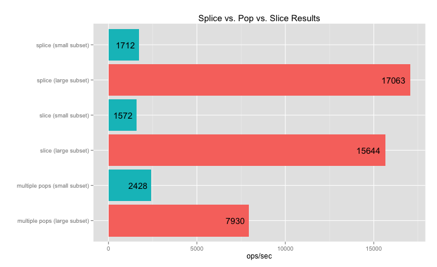

## slice vs pop vs slice to create subsets of an array

Original array of size 10000.

Small subsets have size 2. Large subsets have size 1000.

Doing multiple (2) pops is the fastest if the subsets are small, but calling pop
1000 times for the large subset becomes a bottleneck.  Slice is fastest for a
large subset.  Since slice doesn't modify the original array (unlike pop and
splice), after calling `Array.slice`, we set `Array.length -= n` where `n` is
the subset size.

### Results
```
❯ splice-pop-slice-perf git/master node index.js
splice (small subset) x 333,455,435 ops/sec ±16.80% (60 runs sampled)
slice (small subset) x 364,985,843 ops/sec ±15.00% (67 runs sampled)
multiple pops (small subset) x 561,996,466 ops/sec ±0.60% (96 runs sampled)
splice (large subset) x 564,402,165 ops/sec ±0.24% (101 runs sampled)
slice (large subset) x 572,840,888 ops/sec ±0.25% (96 runs sampled)
multiple pops (large subset) x 383,924,836 ops/sec ±15.79% (68 runs sampled)
Fastest is slice (large subset)
```



### Summary

Use pop if you only need to remove a few elements from the end of an array; use
slice (or splice) if you need to remove a large number of elements.